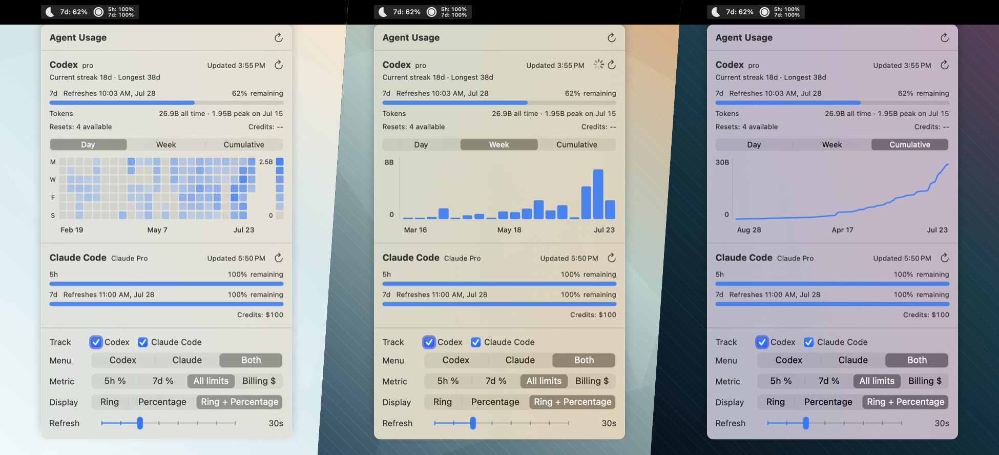

# AgentUsage

A local-only macOS menu-bar app for viewing Codex and Claude usage and activity.



AgentUsage talks directly to the Codex and Anthropic services using credentials already stored by their local clients.
In the case of Codex, it uses the locally authenticated Codex Appserver to fetch usage data. In the case of Claude, it uses the stored Claude Code credential (as file or in keychain) to fetch usage data from the Anthropic API. AgentUsage includes no analytics or telemetry and does not send requests to any third-party servers.

Licensed under the [MIT License](LICENSE).

## Install

AgentUsage is not Apple Developer ID-signed or notarized. The recommended installation path is the release installer:

```sh
curl -fsSL https://github.com/Rock-Z/AgentUsage/releases/latest/download/install.sh \
  | AGENTUSAGE_ALLOW_UNNOTARIZED=1 bash
```

Alternatively, build and install from source:

```sh
./Scripts/build-app.sh --install
```

The DMG on [Releases](https://github.com/Rock-Z/AgentUsage/releases) remains available for manual installation. After installing an updater-enabled release, AgentUsage checks for updates hourly and also provides **Check for Updates** at the bottom of its popout.

The first launch may require using **Open Anyway** in System Settings → Privacy & Security.

## See also

Below are some other alternatives for the same purpose:

- For more providers and a more mature feature set, see [CodexBar](https://github.com/steipete/CodexBar).
- For local usage accounting from coding-agent logs, see [ccusage](https://github.com/ryoppippi/ccusage).

AgentUsage aims to be a minimal, constrained, and aesthetically pleasing to use monitoring utility.
